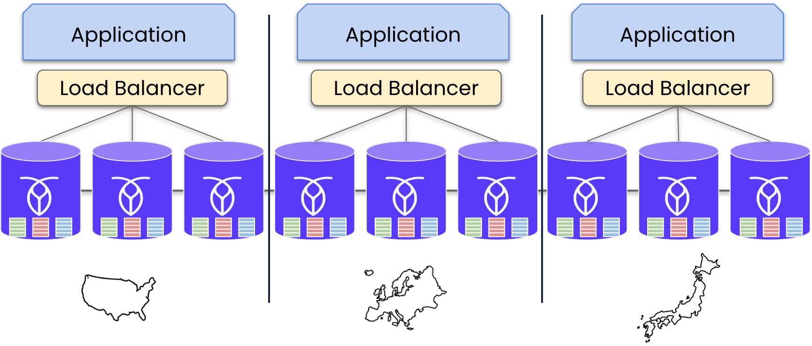
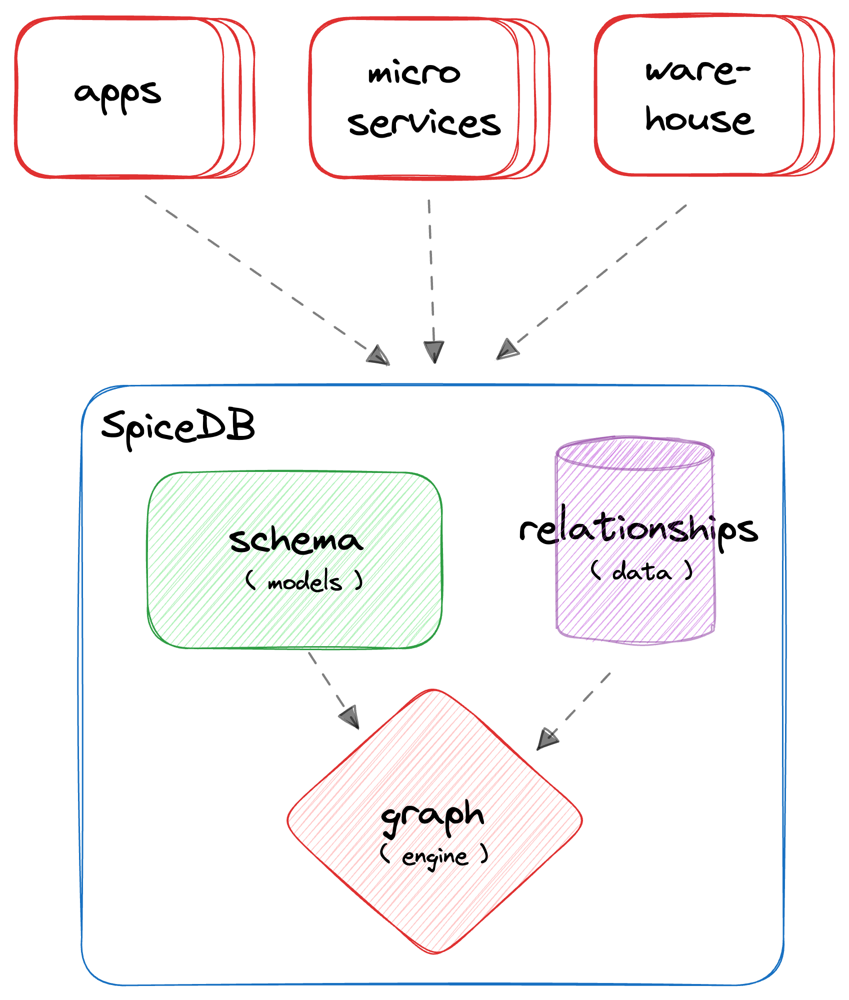

= AuthZed + CockroachDB Joint PoC Environment
:linkattrs:
:project-owner: amineelkouhen
:project-name:  crdb-authzed-sandbox
:project-group: com.cockroachlabs
:project-version:   1.0.0
:site-url:  https://github.com/amineelkouhen/crdb-authzed-sandbox

image:https://img.shields.io/github/contributors/{project-owner}/{project-name}[GitHub contributors]
image:https://img.shields.io/github/forks/{project-owner}/{project-name}[Fork]
image:https://img.shields.io/github/stars/{project-owner}/{project-name}[GitHub Repo stars]
image:https://img.shields.io/github/watchers/{project-owner}/{project-name}[GitHub watchers]
image:https://img.shields.io/github/issues/{project-owner}/{project-name}[GitHub issues]
image:https://img.shields.io/github/license/{project-owner}/{project-name}[License]

---

This project provides a comprehensive set of *Terraform* templates to provision a joint *AuthZed* and *CockroachDB* proof-of-concept (PoC) environment on AWS. The goal is to demonstrate a resilient, distributed IAM architecture that combines AuthZed's authorization stack with CockroachDB's globally consistent SQL database.

== 📋 Prerequisites

- Install https://learn.hashicorp.com/tutorials/terraform/install-cli[Terraform^]
- Ensure SSH access by creating a key pair (e.g., ~/.ssh/id_rsa)
- Obtain an https://docs.aws.amazon.com/IAM/latest/UserGuide/id_credentials_access-keys.html[AWS Access Key and Secret^]
- Update `variables.tf` with your AWS credentials (aws_access_key and aws_secret_key)
- For CockroachDB: obtain a valid CockroachDB License and place the key in the `cluster_license` variable (variables.tf)

== 🪳 CockroachDB - Architecture

CockroachDB is a distributed SQL database designed for horizontal scalability, high availability, and strong consistency. It stores data using a transactional key-value layer, automatically splitting and replicating ranges as data grows. This ensures resilience across failures—even full AZ or region-level outages—without manual intervention.

CockroachDB scales horizontally with minimal operator overhead: At the key-value level, CockroachDB starts off with a single, empty range. As you put data in, this single range eventually reaches a threshold size. When that happens, the data splits into two ranges, each covering a contiguous segment of the entire key-value space. This process continues indefinitely; as new data flows in, existing ranges continue to split into new ranges, aiming to keep a relatively small and consistent range size.

A CockroachDB cluster consists of identical nodes deployed across multiple availability zones (AZs), offering ACID guarantees and global SQL access.

== 👮‍ AuthZed

AuthZed is a technology company specializing in high-performance, scalable authorization infrastructure for software applications. Their solutions are designed to help organizations manage complex permission systems, serving use cases that require fine-grained and dynamic access control.
AuthZed focuses exclusively on authorization — not authentication or identity management — and provides both managed/cloud and open-source solutions via SpiceDB. This allows companies to implement secure, consistent, and scalable permissions management in modern cloud applications without building their own systems from scratch.
Authorization answers the question, “What can a user do once they’ve successfully logged in?” Logging into a system doesn’t mean unrestricted access. Authorization ensures that users can only access what’s necessary for their role. Authorization models vary in how they determine what a user can do.

At its core, SpiceDB is behind the Authorization model provided by all of AuthZed's products. This open-source project was inspired by Google's own internal authorization service: Zanzibar. It is designed to be entirely agnostic to authentication solutions/identity providers. SpiceDB implements a relationship-based permissions model that supports strong consistency, global replication, and extremely high scale, processing millions of authorization requests per second for modern, distributed apps.

Like a relational database, developers define a schema, write data to the database, and query that data in various ways. However, unlike relational databases that use general-purpose SQL, SpiceDB exposes a gRPC API specifically optimized for authorizing actions in your systems.

== 🤝 AuthZed/CockroachDB Joint Architecture

SpiceDB acts as a centralized service that stores authorization data (relationships, and permissions). Developers create a schema that models their permissions requirements, use a client library to apply the schema to the database, and insert data into the database through REST or gRPC APIs.
Once stored, data can be queried to check permissions in your applications. You can answer questions such as “Does this user have access to this resource?” and “What are all the resources this user has access to?”

Authorization requests (e.g., Check, Lookup, Expand) are resolved via a dispatcher that traverses the permission graph and optionally subrequests the other SpiceDB instances that might contain a cache of the recent answers that it has computed so it can serve these answers out of cache directly.

By using CockroachDB as the underlying datastore, SpiceDB gains a globally distributed, strongly consistent SQL foundation. CockroachDB’s multi-region replication and high availability ensure that authorization decisions are consistent, low-latency, and resilient across geographies. Together, this architecture combines SpiceDB’s flexible, API-first authorization model with CockroachDB’s fault-tolerant database platform to deliver secure, fine-grained access control that scales to enterprise workloads worldwide.

CockroachDB, in turn, provides the always-consistent database layer that ensures user access permissions, resources, and relationships between resources and subjects are always accurate — no matter which region is serving a request.

== 📦 Deployment

This configuration generates a high-availability deployment for the joint sandbox within a single cloud region. This architecture is designed to protect against failures at the availability zone (AZ) level by distributing nodes of the database cluster across multiple AZs within the same region.

A regional load balancer distributes traffic across the healthy nodes in the cluster. This NLB improves performance by directing requests to the closest responsive node and provides failover capabilities by rerouting traffic away from any failed or unreachable zones.

=== 🚀 Usage Guide

Each configuration uses .tf.json files that reference Terraform modules for:

- Networking (VPCs, subnets, load balancers)
- DNS and FQDN setup
- CockroachDB clusters
- Bastion host containing SpiceDB.

See examples in `main/aws/Single-Region-Multi-AZ/` for AWS deployments.

Example of a configuration file

[source,json]
----
{
    "provider": {
        "aws": {
            "region": "${var.region_name}",
            "access_key": "${var.aws_access_key}",
            "secret_key": "${var.aws_secret_key}"
        }
    },
    "module": {
        "network-vpc": {
            "source": "../../../../modules/aws/network",
            "name": "${var.deployment_name}-${var.env}",
            "vpc_cidr": "${var.vpc_cidr}",
            "subnets_cidrs": "${var.subnets}",
            "resource_tags" : {}
        },
        "keypair": {
            "source": "../../../../modules/aws/keypair",
            "name": "${var.deployment_name}-${var.env}",
            "ssh_public_key": "${var.ssh_public_key}",
            "resource_tags" : {}
        },
        "crdb-cluster": {
            "source": "../../../modules/aws/cr",
            "name": "${var.deployment_name}-${var.env}",
            "worker_count": "${var.crdb_cluster_size[0]}",
            "machine_type": "${var.crdb_machine_type}",
            "machine_image": "${var.crdb_machine_images[0]}",
            "ssh_user": "${var.ssh_user}",
            "ssh_public_key": "${var.ssh_public_key}",
            "ssh_key_name": "${module.keypair.key-name}",
            "security_groups": "${module.network-vpc.security-groups}",
            "region": "${var.regions[0]}",
            "availability_zones": "${keys(var.crdb_subnets[0])}",
            "subnets": "${module.network-vpc.subnets}",
            "cockroach_release": "${var.crdb_release}",
            "boot_disk_size" : "${var.volume_size}",
            "boot_disk_type" : "${var.volume_type}",
            "resource_tags": {}
        }
    }
}
----

A standalone EC2 client (bastion) is created with all the components and required CLIs/Tools to start working on the joint environment.
In this client host, SpiceDB is installed, deployed and targeting the CockroachDB cluster.

To perform tests - After provisioning:

1- SSH into the bastion host using the public IP from Terraform outputs.

[source,bash]
----
Outputs:
####################################### Client #######################################

client-public-IP = "a.b.c.d"
----

[source,bash]
----
ssh -i ~/.ssh/id_rsa ubuntu@a.b.c.d
----
2- Check setup status via `/home/ubuntu/prepare_client.log`. Wait till you have the following message:
----
Thu Jun 12 16:52:36 UTC 2025 - 💯 Client setting Completed
----

Congratulations 🎉 Now, you can start testing AuthZed capabilities.

=== 🧪 Testing SpiceDB

Writing one or more object type definitions is the first step in developing an authorization relationship schema.

In the following example, we define the `user` and `document` concepts. The user can be a `viewer`, an `editor` or `admin`.
The definition gives the `remove` permission to the `admin` role only. To `edit` a file you must be either an `editor` or `admin`. The permission to `view` a document is set for viewer, editor and admin roles.

[source,shell]
----
definition user {}

definition document {
    relation editor: user
    relation viewer: user
    relation admin: user

    permission view = viewer + editor + admin
    permission edit = editor + admin
    permission remove = admin
}
----

After creating the schema that models your resources and the required permissions, you can apply and check permissions from your application using zed, client libraries, or through the API:

==== ⌨️ Zed CLI

The Zed CLI is a command line tool we can use for interacting with SpiceDB.

Users for both macOS and Linux can install the latest binary releases of zed using the official tap:

[source,bash]
----
brew install authzed/tap/zed
----

Once installed you can connect to the SpiceDB exposed in the client with the command below.
For local development we can use the `--insecure` flag to connect over plaintext. Be sure to replace the `key` with the one you used in the `preshared_key` variable in `variables.tf`.

[source,bash]
----
zed context set my_contex <client_IP>:50051 <key> --insecure
----

You can check the above command worked by running:

[source,bash]
----
zed version
----

[Note]
====
If the output of zed version shows the server version as unknown then your CLI was unable to connect so you may need to double check some values in the previous steps such as the `key`, the client IP or the port your SpiceDB instance is running on.
====

Now, you can use the Zed CLI to write your schemas into SpiceDB. First, let's save the schema created earlier as `schema.zed` and execute the following command:

[source,bash]
----
zed schema write ./schema.zed
----

If it works you should see your schema printed after running the read command.

[source,bash]
----
zed schema read
----

Now that our schema is written we can seed some test data using the Zed CLI. We’ll create a set of users `amine`, jake` and 'evan' and add them as with different roles for a specific document (`doc1`).

[source,bash]
----
zed relationship touch document:doc1 admin user:amine
zed relationship touch document:doc1 editor user:evan
zed relationship touch document:doc1 viewer user:jake
----

In SpiceDB relationships are represented as relation tuples. Each tuple contains a resource, a relation and a subject. In our case the resource is the name of a document, the relation is either admin, viewer or editor, and the subject is the name of a user.

To check our schema is working correctly we can issue a couple of check requests. As `jake` is only a viewer for `doc1` we expect him to have the `view` permission but not the `edit` or `remove` permissions.
Conversely, as `amine` is an admin we expect him to have all permissions.

[source,bash]
----
zed permission check document:doc1 view user:jake
# output: true

zed permission check document:doc1 remove user:jake
# output: false

zed permission check document:doc1 edit user:jake
# output: false
----

==== 🌐 SpiceDB API

You can use the client libraries or the gRPC (on port 50051 like the one used by zed) and HTTP APIs (on port 8443) to query SpiceDB.
For example, to write the schema, we've created earlier you can use the following API call:

[source,bash]
----
curl --location 'http://<client_IP>:8443/v1/schema/write' \
--header 'Content-Type: application/json' \
--header 'Accept: application/json' \
--header 'Authorization: Bearer <preshared_key>' \
--data '{
    "schema": "definition user {} \n definition document { \n relation editor: user \n relation viewer: user \n relation admin: user \n permission view = viewer + editor + admin \n permission edit = editor + admin \n permission remove = admin \n}"
}'

# output:
# {"writtenAt":{"token":"GhUKEzE3NTgxMjkyOTM0MDE2MDYxNDA="}}
----

Now that our schema is written, we can seed some test data using the API. We’ll create an additional user called `allen` and add him as an additional `admin` for the document `doc1`.

[source,bash]
----
curl --location 'http://<client IP>:8443/v1/relationships/write' \
--header 'Content-Type: application/json' \
--header 'Accept: application/json' \
--header 'Authorization: Bearer <preshared_key>' \
--data '{
    "updates": [
        {
            "operation": "OPERATION_TOUCH",
            "relationship": {
                "resource": {
                    "objectType": "document",
                    "objectId": "doc1"
                },
                "relation": "admin",
                "subject": {
                    "object": {
                        "objectType": "user",
                        "objectId": "allen"
                    }
                }
            }
        }
    ]
}'

# output :
# {"writtenAt":{"token":"GhUKEzE3NTgxMjk3MDg2NTc4MDQ5ODk="}}
----

Now, let's check that `allen` has all permissions on document `doc1`:

[source,bash]
----
curl --location 'http://<client IP>:8443/v1/permissions/check' \
--header 'Content-Type: application/json' \
--header 'Accept: application/json' \
--header 'Authorization: Bearer <preshared_key>' \
--data '{
  "consistency": {
    "minimizeLatency": true
  },
  "resource": {
    "objectType": "document",
    "objectId": "doc1"
  },
  "permission": "remove",
  "subject": {
    "object": {
      "objectType": "user",
      "objectId": "allen"
    }
  }
}'

# output :
# {"checkedAt":{"token":"GhUKEzE3NTgxMjk5NTAwMDAwMDAwMDA="}, "permissionship":"PERMISSIONSHIP_HAS_PERMISSION", "partialCaveatInfo":null, "debugTrace":null, "optionalExpiresAt":null}
----

=== ⚙️ Terraform Execution

To initialize and deploy:

[source,bash]
----
terraform init
terraform plan
terraform apply
----

Terraform will provision two logical clusters with:

- For CockroachDB:

    * VPC and subnets (each in a distinct Availability Zone)
    * Network Load Balancers
    * 3-node CockroachDB cluster (each worker in a distinct subnet)

- For AuthZed:
    * A bastion host containing SpiceDB, deployed and linked to the CockroachDB cluster.

Sample output includes URLs and IPs for the deployed environment:

[source,bash]
....
Outputs:
####################################### Client #######################################

client-public-IP = "34.218.168.56"

####################################### CRDB Cluster #################################

connection-string = "postgresql://root@nlb-20250917111511554200000004-9d1a05177d0cea95.elb.us-east-1.amazonaws.com:26257/defaultdb"
console-url = "http://nlb-20250917111511554200000004-9d1a05177d0cea95.elb.us-east-1.amazonaws.com:8080/"

crdb-cluster-private-ips = [
  "10.1.1.156",
  "10.1.2.85",
  "10.1.3.45",
]
crdb-cluster-public-ips = [
  "54.208.198.178",
  "54.234.100.0",
  "3.94.208.110",
]
....